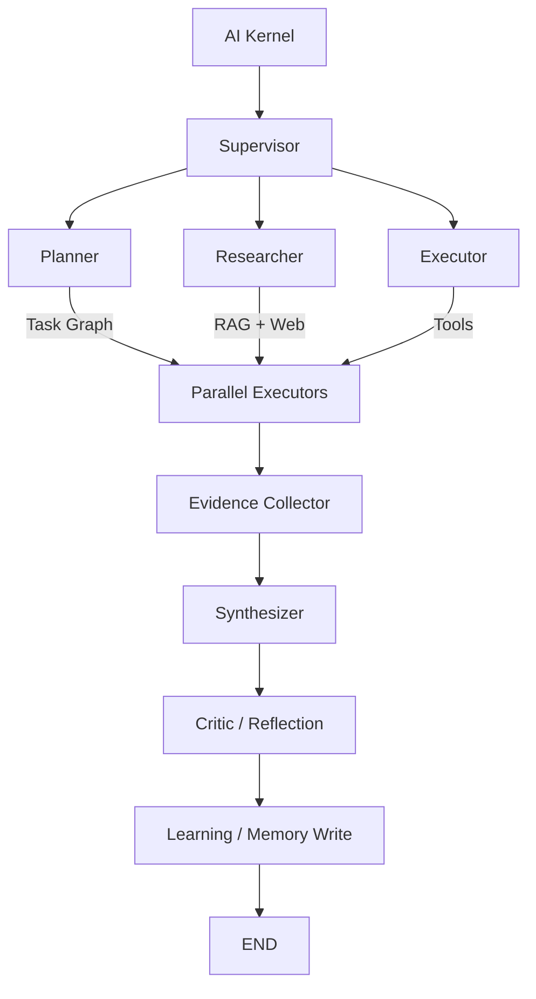
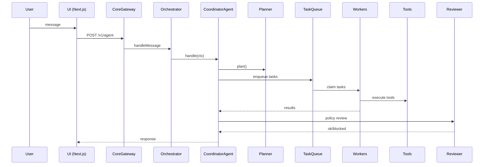
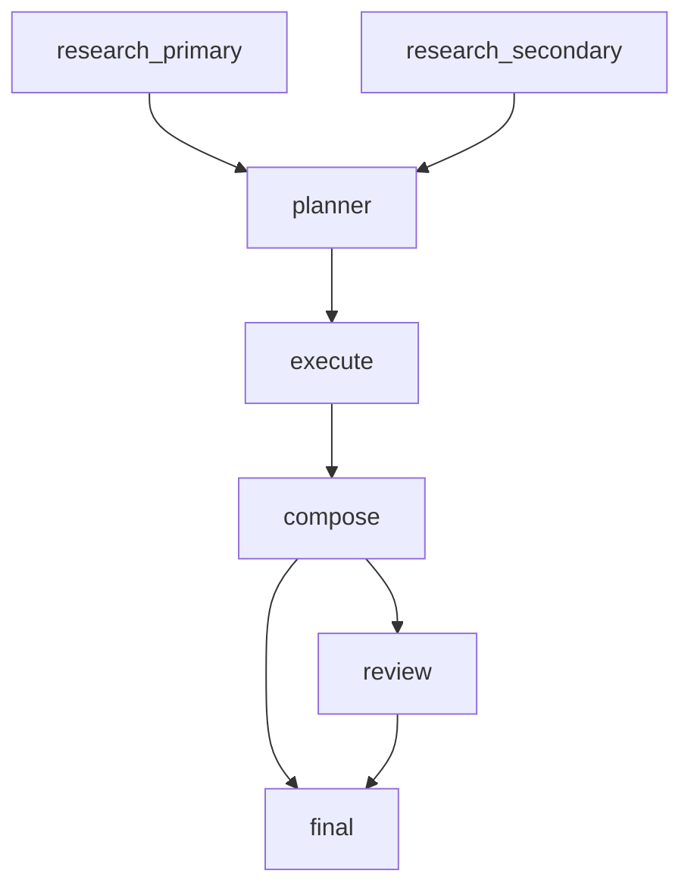
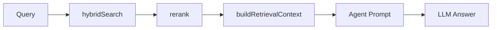
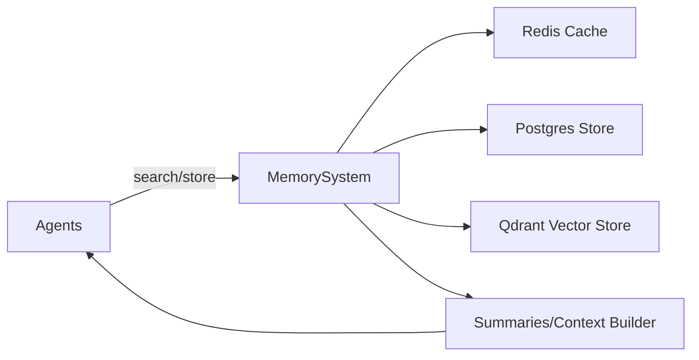

# IA Assistant: AI Autonomous Operating System

IA Assistant é um **AI Autonomous Operating System** (AI-OS) local-first, projetado para operar como um organismo de agentes inteligentes capazes de planejar, executar, refletir e aprender continuamente.

## Missão e Princípios

Evoluir o sistema para um ecossistema autônomo baseado nos seguintes pilares:

- **AI Kernel**: Orquestrador central de recursos (CPU/Memória/LLM) e segurança.
- **Agent Ecosystem**: Diversidade de agentes especializados (Meta, Planner, Research, Executor, Critic, Improvement).
- **Self-Improving Loop**: Capacidade de autocrítica, refatoração de código e evolução de prompts.
- **Modular & Event-Driven**: Comunicação baseada em eventos (`task_created`, `task_started`, `agent_spawned`, `agent_finished`, `tool_called`, `tool_failed`, `learning_event`).
- **Local-First & Secure**: Foco em privacidade e governança com níveis de permissão (`safe`, `restricted`, `dangerous`).

### Funcionalidades Core

- **AI Kernel (src/runtime.ts)**: Gerenciamento centralizado de Gateway, Orquestrador, Workflows, Memória e Tools.
- **Agent Spawning**: Criação dinâmica de novos agentes sob demanda via `Meta-Agent`.
- **Cognitive Architecture**: Ciclo Perception → Reasoning → Planning → Execution → Reflection → Learning.
- **Tool Governance**: Níveis de permissão (`safe/restricted/dangerous`), firewall de instruções e aprovação explícita para operações sensíveis.
- **Memory System (3 Níveis)**: Short-term (contexto), Working (estado) e Long-term (Vector DB + Knowledge Graph).
- **Learning System**: Otimização de estratégias baseada em experiência e feedback de performance.

[](#)
[](#)
[](#)
[](#)
[](#)
[](#)

---

## Sumário

- [Arquitetura](#arquitetura)
- [Estrutura do Repositório](#estrutura-do-repositório)
- [Stack e Tecnologias](#stack-e-tecnologias)
- [Como Rodar (Dev/Prod)](#como-rodar-devprod)
- [Receitas Rápidas (Como Usar)](#receitas-rápidas-como-usar)
- [Gateway: API, Autenticação e Rate Limit](#gateway-api-autenticação-e-rate-limit)
- [Orquestração Multi-Agente](#orquestração-multi-agente)
- [Cognition, Swarm e World Model](#cognition-swarm-e-world-model)
- [Agent Profiles](#agent-profiles)
- [Ferramentas, Permissões e Auditoria](#ferramentas-permissões-e-auditoria)
- [Memória](#memória)
- [Fila, Workers, Autoscaling e Autonomia](#fila-workers-autoscaling-e-autonomia)
- [Workflows e Triggers](#workflows-e-triggers)
- [UI Web](#ui-web)
- [Integração com o Repo `openclaw` (opcional)](#integração-com-o-repo-openclaw-opcional)
- [Infra (K8s + Prometheus)](#infra-k8s--prometheus)
- [Qualidade e Testes](#qualidade-e-testes)
- [Simulation Sandbox](#simulation-sandbox)
- [Benchmark e Evaluation](#benchmark-e-evaluation)
- [Troubleshooting](#troubleshooting)
- [Contribuição](#contribuição)
- [Autor](#autor)
- [Docs](#docs)

---

## Arquitetura

### Visão Geral (alto nível)

O IA Assistant é composto por 2 aplicações principais:

- **Core (Node.js + TypeScript)**: roda o gateway, agentes, tools, memória, fila, triggers, workflows e observabilidade.
- **UI (Next.js)**: um chat web que chama o Core via `POST /api/chat` (proxy para `POST {GATEWAY_URL}/v1/agent`).

### Fluxo do Chat (UI → Core)

1. Usuário escreve na UI.
2. UI chama `POST /api/chat` (Next Route Handler).
3. A rota da UI valida request, aplica timeout e faz proxy para `POST {GATEWAY_URL}/v1/agent`.
4. O Gateway do Core recebe um `GatewayMessage` e encaminha para o `AgentOrchestrator`.
5. O `CoordinatorAgent` decide estratégia (planejamento vs execução direta), cria tasks (research/execute/analyze), aguarda resultados e monta resposta final.
6. A resposta volta para UI e é renderizada na lista de mensagens.

### AI Kernel (Runtime API)

O runtime expõe um **AI Kernel** (classe `AIKernel`) que encapsula os subsistemas e o ciclo de vida do Core:

```ts
import { createRuntime } from "./src/runtime.js";

const kernel = await createRuntime();
await kernel.start({ port: 18789 });
// ...
kernel.stop();
```

### AI-OS v2 (arquitetura hierárquica)



### Sequence Diagram (Mermaid)



### Agent Graph (DAG)



### Graph State (contrato do “estado” por execução)

Mesmo sem LangGraph, o Core trabalha como um grafo/pipeline e há um “estado lógico” que evolui ao longo das etapas. Um contrato útil (documentação) é:

```ts
export type AIState = {
  input: string;
  plan: { tasks?: any[]; steps?: any[]; plannerEngine?: string } | null;
  route: "direct_execution" | "planning";
  evidence: string[];
  toolsUsed: string[];
  answer: string;
  critique: string | null;
  retries: number;
  traceId?: string;
  sessionId?: string;
  userId?: string;
};
```

### RAG Subgraph (Retriever → Ranker → Context Builder → Answer)

O Core possui um pipeline de recuperação (RAG) utilizado para montar contexto de forma consistente antes do planner e/ou da resposta final. Ele funciona como um “subgrafo” independente dentro do fluxo:

- **Retriever**: `hybridSearch` (semantic + keyword) em [hybrid-search.ts](./src/memory/retrieval/hybrid-search.ts)
- **Ranker**: `rerank` (opcional via LLM) em [reranker.ts](./src/memory/retrieval/reranker.ts)
- **Context Builder**: `buildRetrievalContext` em [context-builder.ts](./src/memory/retrieval/context-builder.ts)
- **Orquestração do contexto do agente**: [context-builder.ts](./src/agents/context-builder.ts)



### Self-Reflection Loop (self-correcting output)

O Core pode rodar um loop de auto-crítica que revisa e reescreve a resposta final quando a qualidade (score) está abaixo do threshold:

- Engine: [improvement-loop.ts](./src/cognition/self-reflection/improvement-loop.ts)
- Integração: [coordinator-agent.ts](./src/agents/roles/coordinator-agent.ts)

```mermaid
flowchart TD
  EX[Executor/Composer] --> CR[Critic]
  CR -->|PASS| END[END]
  CR -->|FAIL (rewrite)| EX
```

### Memory Flow (Mermaid)



Principais pontos “de produto”:

- O Core é o “cérebro” e a UI é um “console”.
- Todas as ações passam por governança e, quando aplicável, auditoria.
- O sistema foi desenhado para funcionar local-first, mas suporta Redis/Postgres/Qdrant para produção.

---

## Estrutura do Repositório

Diretórios principais:

- Core:
  - [src](./src): runtime, gateway, agentes, tools, memória, triggers, workflows, observabilidade etc.
  - [infra](./infra): manifests K8s e config Prometheus.
  - [.env.example](./.env.example): template de variáveis do Core.
  - [package.json](./package.json): scripts e dependências do Core.
- UI:
  - [ui](./ui): app Next.js.
  - [ui/.env.example](./ui/.env.example): template de variáveis da UI.
  - [ui/app](./ui/app): App Router (página, layout, componentes, hooks e rota `/api/chat`).

---

## Stack e Tecnologias

### Core (Node.js + TypeScript)

- **Node.js** (runtime): execução do gateway e workers.
- **TypeScript**: tipagem e arquitetura em camadas.
- **HTTP server nativo (`node:http`)**: gateway sem frameworks pesados.
- **WebSocket (`ws`)**: endpoint WS para mensagens em tempo real.
- **Zod**: validação de payload e schemas.
- **Redis (`ioredis`)**: fila e memória curta (opcionais).
- **Postgres (`pg`)**: memória de longo prazo (opcional).
- **Qdrant (`@qdrant/js-client-rest`)**: memória semântica (opcional).
- **Prometheus client (`prom-client`)**: métricas em `/metrics`.
- **dotenv**: carregamento de `.env` em dev.

Camada de LLM (multi-provider):

- **LLM Provider Layer (`src/llm/*`)**: abstração única para múltiplos provedores e um router inteligente (cheap/reasoning/coding/offline).
- Providers suportados (via env): OpenAI-compatible, Anthropic, Mistral e Ollama local.

Qualidade/Tooling:

- **ESLint** (airbnb-typescript + prettier) e **Prettier**.
- **tsx** para rodar TypeScript em dev.
- **node:test** para testes.

### UI (Next.js)

- **Next.js 14** (App Router): render e API routes.
- **React 18**.
- **Tailwind CSS** + PostCSS/Autoprefixer: UI rápida e consistente.
- ESLint (config-next) + Prettier.

---

## Como Rodar (Dev/Prod)

### Requisitos

- Node.js 20+ (recomendado)
- npm
- (Opcional) Redis / Postgres / Qdrant para produção

### Setup do Core

Na pasta do Core (`ia-assistant/`):

```bash
npm install
```

Opcional (recomendado para ambientes mais estáveis):

```bash
copy .env.example .env
```

Nota de segurança:

- Nunca commite `.env`/`.env.*` (são segredos). Se uma chave vazar, revogue/rotacione no provedor e substitua localmente.

### Rodar o Core em desenvolvimento

```bash
npm run dev
```

Por padrão, o gateway sobe em `http://localhost:18789`.

Health check:

```bash
curl http://localhost:18789/health
```

Dashboard:

- http://localhost:18789/dashboard

### Setup e execução da UI

Na pasta da UI (`ui/`):

```bash
npm install
```

Configuração de env da UI:

```bash
copy .env.example .env.local
```

Rodar:

```bash
npm run dev
```

UI:

- http://localhost:3000/
- Debug visual (timeline): http://localhost:3000/debug

### Produção (build)

Core:

```bash
npm run build
npm start
```

UI:

```bash
cd ui
npm run build
npm start
```

---

## Receitas Rápidas (Como Usar)

### Enviar uma mensagem (HTTP)

```bash
curl -X POST http://localhost:18789/v1/agent ^
  -H "Content-Type: application/json" ^
  -d "{\"text\":\"Olá\",\"sessionId\":\"sess-1\",\"userId\":\"u1\",\"channel\":\"http\",\"modality\":\"text\",\"metadata\":{\"traceId\":\"demo-trace\"}}"
```

### Streaming (SSE)

```bash
curl -N -X POST http://localhost:18789/v1/agent/stream ^
  -H "Content-Type: application/json" ^
  -d "{\"text\":\"Me explique a arquitetura\",\"sessionId\":\"sess-1\",\"userId\":\"u1\",\"channel\":\"http\",\"modality\":\"text\"}"
```

### Use Case (exemplo end-to-end)

Objetivo: “Pesquisar LangGraph e resumir boas práticas”.

O que acontece no Core (alto nível):

1. **Planner** cria um plano (tasks research/execute/analyze) e dependências (quando aplicável).
2. **Workers** executam as tasks (ex.: `research` chama tools de busca; `execute` chama tools com side effects controlados).
3. **Synthesizer/Composer** agrega evidências e compõe a resposta final.
4. **Critic/Reviewer** revisa (governança/política + self-reflection opcional).
5. **Learning/Episodic** registra experiência (episódio + eventos de aprendizado).

Exemplo (HTTP):

```bash
curl -X POST http://localhost:18789/v1/agent ^
  -H "Content-Type: application/json" ^
  -d "{\"text\":\"Pesquise LangGraph e resuma boas práticas.\",\"sessionId\":\"sess-2\",\"userId\":\"u1\",\"channel\":\"http\",\"modality\":\"text\"}"
```

### Pairing para DMs/canais (segurança)

Config recomendado (não responde para não autorizados):

- `OPENCLAW_X_DM_POLICY=pairing`
- `IA_ASSISTANT_DM_PAIRING_SEND_CODE=0`

Inspecionar/autorizar (admin):

- `GET /v1/pairing/pending`
- `POST /v1/pairing/approve` com `{ "code": "..." }`

### Observabilidade + Visual Debugger

Ativar logs e buffer (Core `.env`):

- `IA_ASSISTANT_AI_OBS_LOG=1`
- `IA_ASSISTANT_AI_OBS_BUFFER=200`

Ver eventos (admin):

- `GET /v1/observability/agents?limit=50`
- `GET /v1/observability/agents/stats`

Abrir a timeline:

- `http://localhost:3000/debug`

### Tool Marketplace (plugins locais)

Listar tools registradas (admin):

- `GET /v1/tools/marketplace`

Recarregar plugins (admin):

- `POST /v1/tools/marketplace/reload`

### Tool Intelligence (admin)

Ativar no Core `.env`:

- `IA_ASSISTANT_TOOL_INTELLIGENCE_ENABLE=1`

Listar perfis observados (admin):

- `GET /v1/tools/intelligence?limit=200`

Pedir recomendação (admin):

- `POST /v1/tools/intelligence/recommend` com `{ "query": "search", "limit": 5 }`

### Distributed Agent Cluster (admin)

Pré-requisito:

- Redis configurado em `OPENCLAW_X_TASKS_REDIS_URL` (fila distribuída).

Rodar um cluster mínimo (3 processos):

```bash
# Node 1: gateway + planner + dispatch (sem workers locais)
npm run dev -- --serve --port 18789 --role runtime

# Node 2: workers (consomem tasks do Redis)
npm run dev -- --role worker

# Node 3: simulation (opcional; normalmente roda só a CLI de simulação)
npm run simulate -- run --scenario src/simulation/scenarios/research-task.yaml --runs 1
```

Inspecionar nós (admin):

- `GET /v1/cluster/nodes?role=worker&includeStale=0&staleMs=15000`
- `POST /v1/cluster/nodes/reap` com `{ "staleMs": 60000 }`

### Long-Term Learning (admin)

Ativar no Core `.env`:

- `IA_ASSISTANT_LONGTERM_LEARNING_ENABLE=1`

Stats:

- `GET /v1/learning/stats?limit=10000`

Exportar dataset JSONL (para fine-tuning/prompt tuning):

- `POST /v1/learning/dataset/export` com `{ "limit": 10000 }`

Registrar correção do usuário (para supervisionado):

- `POST /v1/feedback/correction` com `{ "sessionId":"...", "userId":"...", "prompt":"...", "answer":"...", "correction":"..." }`

### Agent Performance Optimizer (admin)

Ativar no Core `.env`:

- `IA_ASSISTANT_OPTIMIZER_ENABLE=1`

Status:

- `GET /v1/optimization/status`

Forçar uma avaliação (útil para testar tuning sem esperar o intervalo):

- `POST /v1/optimization/model-router/evaluate`

### Skill Learning (admin)

Listar sugestões/skills:

- `GET /v1/skill-learning`

Aprovar uma sugestão:

- `POST /v1/skill-learning/approve` com `{ "id": "..." }`

Criar manualmente:

- `POST /v1/skill-learning/create` com `{ "id": "pdf-table-extraction", "description": "...", "steps": [...] }`

Depois de registrada, a skill vira uma tool:

- `skill.<id>` (ex.: `skill.pdf-table-extraction`)

### Marketplace (openclaw-repo) via tool

Se `IA_ASSISTANT_MARKETPLACE_REPO_PATH` (ou `openclaw-repo/`) estiver configurado, o Core registra tools:

- `marketplace.list`
- `marketplace.install` com `{ "kind": "agent|skill|tool", "name": "..." }`
- `marketplace.apply`

### Simulation Sandbox (rodar cenários locais)

Rodar um cenário YAML:

```bash
npm run simulate -- run --scenario src/simulation/scenarios/research-task.yaml --runs 1
```

### Agent Factory (MVP)

Detectar capacidades (heurístico) e gap:

```bash
npm run agent-factory -- detect --task "extract clauses from legal contract pdf"
```

Gerar um plugin de agente (saída em `.ia-assistant/agent-factory/generated`):

```bash
npm run agent-factory -- generate --task "extract clauses from legal contract pdf" --name "legal-analysis-agent"
```

### Reasoning: Debate Engine (negociação multi-agente)

Ativar no Core `.env`:

- `IA_ASSISTANT_REASONING_ENGINE=debate`
- (opcional) `IA_ASSISTANT_REASONING_DEBATE_LLM=1` + `IA_ASSISTANT_LLM_ENABLE=1`

---

## Configuração (Core `.env`)

O Core lê variáveis de ambiente para habilitar autenticação, integrações e recursos avançados. Em dev, use:

```bash
copy .env.example .env
```

### Gateway / Segurança

- `OPENCLAW_X_PORT`: porta do gateway (default 18789).
- `OPENCLAW_X_ADMIN_TOKEN`: token admin (Bearer) para endpoints protegidos.
- `OPENCLAW_X_PUBLIC_TOKEN`: token público (Bearer) opcional (role `user`).
- `OPENCLAW_X_ALLOW_QUERY_TOKEN`: `1` permite token via `?token=` em casos específicos (dashboard e, quando habilitado, WebSocket). Em produção, mantenha `0`.
- `OPENCLAW_X_DM_POLICY`: `pairing|open|closed` (controle de DMs/canais).
- `IA_ASSISTANT_DM_PAIRING_SEND_CODE`: `0|1` (default `0`). Quando `OPENCLAW_X_DM_POLICY=pairing`, controla se o sistema pode enviar o código de pairing para o remetente (recomendado manter `0` para não enviar mensagens a não autorizados).
- `OPENCLAW_X_AUDIT_LOG`: `1` habilita audit log (tool calls em JSONL com redaction).

### Fila / Memória (produção)

- `OPENCLAW_X_TASKS_REDIS_URL`: habilita fila Redis (se vazio, usa fila in-memory).
- `OPENCLAW_X_REDIS_URL`: Redis para memória curta (opcional).
- `OPENCLAW_X_POSTGRES_URL`: Postgres para memória longa (opcional).
- `OPENCLAW_X_QDRANT_URL`: Qdrant para memória semântica (opcional).
- `OPENCLAW_X_QDRANT_COLLECTION`: nome da collection.

### Observabilidade

- `OPENCLAW_X_OTLP_URL`: exportação de spans via HTTP/JSON (opcional).
- `IA_ASSISTANT_AI_OBS_LOG=1`: emite logs JSON por execução de agent com tokens estimados, tool calls, latência e custo.
- `IA_ASSISTANT_AI_OBS_LOG_FORMAT`: `json|text` (default `json`). `text` imprime linha humana no formato `Agent: planner Tokens: ...`.
- `IA_ASSISTANT_AI_OBS_BUFFER`: tamanho do buffer in-memory para endpoints de observabilidade (default 200).
- `IA_ASSISTANT_LLM_COST_DEFAULT_PER_1K`: custo estimado (USD) por 1k tokens (fallback para cálculo de custo).

Componentes:

- **OpenTelemetry**: spans do tracer são exportados via `OPENCLAW_X_OTLP_URL`.
- **Prometheus**: métricas em `GET /metrics`.
- **AI Observability**: `AgentTracker` emite eventos `ai.observability` e o gateway expõe `GET /v1/observability/agents`.
- **Tool audit/replay**: JSONL com redaction e endpoint `POST /v1/audit/replay`.
- **Token/custo/latência**: estimados e agregados por agente (stats).

Endpoints (admin):

- `GET /v1/observability/agents?limit=50&agent=planner&sessionId=...&traceId=...`: últimos eventos de execução por agent.
- `GET /v1/observability/agents/stats`: agregação in-memory por agent (runs, latência média, tokens, tool calls, custo).

### Reasoning Engine (Tree of Thoughts / Reflexion)

- `IA_ASSISTANT_REASONING_ENGINE=tot`: usa Tree of Thoughts para gerar um plano `steps[]` com múltiplas alternativas e seleção por score (quando `IA_ASSISTANT_LLM_ENABLE=1`).
- `IA_ASSISTANT_REASONING_ENGINE=reflexion`: revisa a resposta final antes do Reviewer (melhora clareza/robustez mantendo governança).
- `IA_ASSISTANT_REASONING_ENGINE=debate`: executa um “debate” (planner → críticas → votação) para escolher uma proposta (útil para tarefas complexas; quando habilitado, pode usar LLM).
- `IA_ASSISTANT_TOT_BRANCHES`: número de alternativas por iteração (default 3).
- `IA_ASSISTANT_TOT_DEPTH`: profundidade de refinamento (default 2).
- `IA_ASSISTANT_REASONING_DEBATE_LLM=1`: usa LLM para gerar propostas/críticas no modo `debate` (fallback heurístico se falhar).

### Cognition, Swarm e World Model

Arquitetura cognitiva em `src/cognition` (perception → reasoning → planning → execution → reflection → learning) e um World Model em `src/world-model`.

Flags:

- `IA_ASSISTANT_COGNITION_ENABLE=1`: habilita o pipeline cognitivo no `CoordinatorAgent` (percepção/razão/plano) e grava traces de aprendizado.
- `IA_ASSISTANT_SWARM_ENABLE=1`: permite spawn de sub-agents em tarefas complexas e injeta o output no `metadata.contextText`.
- `IA_ASSISTANT_SWARM_HIERARCHY_ENABLE=1`: expande a pesquisa em “manager → workers” (ex.: research_web/research_papers/research_data) antes do planner.
- `IA_ASSISTANT_COGNITION_REASONING_LLM=1`: usa LLM opcionalmente para enriquecer riscos/assumptions/constraints (fallback heurístico).
- `IA_ASSISTANT_COGNITION_REFLECTION_LLM=1`: usa LLM opcionalmente para revisão/refinamento (reflexion-style) antes do reviewer (fallback para no-op).
- `IA_ASSISTANT_SELF_REFLECTION_ENABLE=1`: roda self-critic com score 0–1 e reescrita quando abaixo do threshold.
- `IA_ASSISTANT_SELF_REFLECTION_THRESHOLD`: score mínimo (0–1) para aceitar sem refazer.
- `IA_ASSISTANT_SELF_REFLECTION_MAX_ITERS`: máximo de iterações de melhoria.
- `IA_ASSISTANT_WORLD_MODEL_ENABLE=1`: habilita o World Model e as tools abaixo (snapshot + previsão + avaliação de decisões).
- `IA_ASSISTANT_WORLD_MODEL_PREDICT_LLM=1`: usa LLM opcionalmente no predictor do World Model (fallback heurístico).
- `IA_ASSISTANT_MEMORY_RETRIEVAL_INTELLIGENCE=1`: habilita recuperação híbrida (semantic + keyword) com rerank opcional.
- `IA_ASSISTANT_MEMORY_RERANKER_LLM=1`: rerank via LLM (fallback heurístico).

Ferramentas (quando habilitado):

- `world.state`: retorna um snapshot do estado (contadores + objetivos recentes).
- `world.predict`: prevê outcome/risco dado um `objective`.
- `world.evaluate_decision`: simula e ranqueia planos (recebe `objective` e `plans[]`).

### Research-Grade Intelligence (Advanced)

O sistema integra camadas de pesquisa avançada para auto-evolução e raciocínio complexo.

#### Meta-Agent (Architecture Design)
- `IA_ASSISTANT_META_AGENT_ENABLE=1`: permite que a IA projete novas arquiteturas de agentes e workflows dinamicamente.
- Ferramentas: `meta.design_architecture`, `meta.design_workflow`, `meta.generate_agents` (compat: `meta_agent.design`, `meta_agent.generate_agents`).

#### Prompt Evolution
- `IA_ASSISTANT_PROMPT_EVOLUTION_ENABLE=1`: habilita o loop de evolução de prompts (V1 -> V2 -> benchmark -> V3).
- Ferramentas: `prompt_evolution.analyze_dataset`, `prompt_evolution.evolve`.

#### Model Intelligence (Router)
- `IA_ASSISTANT_MODEL_INTELLIGENCE_ENABLE=1`: roteamento baseado em latência, custo e precisão.
- Ferramentas: `models.profile`, `models.benchmark`.

#### Cognitive Tree Reasoning
- `IA_ASSISTANT_COGNITIVE_TREE_ENABLE=1`: evolução do ToT para uma árvore cognitiva completa.
- Ferramenta: `reasoning.tree.plan`.

#### Knowledge Graph Inference
- `IA_ASSISTANT_KG_INFERENCE_ENABLE=1`: motor de inferência sobre o grafo de conhecimento.
- Ferramenta: `graph.infer`.

#### Autonomous Research Loop
- `IA_ASSISTANT_RESEARCH_LOOP_ENABLE=1`: transforma o sistema em uma IA pesquisadora (Hypothesis -> Experiment -> Results).
- Ferramentas: `research.hypothesis`, `research.experiment`, `research.analyze`.

#### Emergent Swarm Intelligence
- `IA_ASSISTANT_EMERGENT_SWARM_ENABLE=1`: inteligência coletiva real com votação e consenso.
- Ferramentas: `swarm.coordinate`, `swarm.consensus`.
- `IA_ASSISTANT_SWARM_REPUTATION_FLUSH_MS`: intervalo para salvar reputação dos agentes.
- `IA_ASSISTANT_AI_SAFETY_ENABLE=1`: bloqueia prompt injection e exige confirmação para tools de alto risco.
- `IA_ASSISTANT_PLANNING_ENGINE=1`: habilita goal decomposer + plan generator + validator como fallback no planner.
- `IA_ASSISTANT_PLANNER_ENGINE=goap|htn|llm`: seleciona engine do planner (`goap`/`htn` geram `steps` com dependências; `llm` força planner via LLM).
- `IA_ASSISTANT_EXPERIMENTS_ENABLE=1`: habilita tool `experiments.ab_test` para execução A/B por prompts.
- `IA_ASSISTANT_SKILL_REGISTRY_ENABLE=1`: carrega manifests de `.ia-assistant/skills/registry.json` e registra tools `skill.<id>.info/run`.
- `IA_ASSISTANT_SKILL_REGISTRY_PATH`: caminho relativo (a partir do root) para o registry JSON (default: `.ia-assistant/skills/registry.json`).
- Exemplo: [.ia-assistant/skills/registry.json](file:///c:/Users/USER/Desktop/ia-assistant/ia-assistant/.ia-assistant/skills/registry.json)

Uso (exemplo):

```env
IA_ASSISTANT_SKILL_REGISTRY_ENABLE=1
IA_ASSISTANT_SKILL_REGISTRY_PATH=.ia-assistant/skills/registry.json
```

- Docs: [docs/architecture/README.md](./docs/architecture/README.md)

### Agent Profiles

Perfis controlam estilo, fontes e `temperature` por agente quando `IA_ASSISTANT_LLM_ENABLE=1`.

- Arquivo padrão: `.ia-assistant/agent-profiles.json`
- Override: `IA_ASSISTANT_AGENT_PROFILES_PATH=<path>`
- Campos suportados por perfil: `id`, `style`, `sources`, `temperature`, `system`

### Integração opcional com repo `openclaw`

- `OPENCLAW_REPO_PATH`: caminho para `.../openclaw` (skills/plugins/cron).
- `OPENCLAW_X_SYNC_CRON`: `1` tenta sincronizar cron jobs via CLI `openclaw` (se instalado).

### Agent Factory (Geração de Agentes)

Módulos para detectar lacunas de capacidade e gerar/registrar agentes automaticamente (MVP).

Implementação:

- Capability detector: [capability-detector.ts](./src/agent-factory/capability-detector.ts)
- Registry: [agent-registry.ts](./src/agent-factory/agent-registry.ts)
- Designer/Generator/Validator/Deployer: [src/agent-factory](./src/agent-factory)

Flags:

- `IA_ASSISTANT_AGENT_FACTORY_ENABLE=1`: habilita o pipeline de Agent Factory.
- `IA_ASSISTANT_AGENT_FACTORY_LLM_EXTRACT=1`: usa LLM para extrair capabilities da tarefa (fallback heurístico se falhar).

### Agent Skill Learning System (skills que evoluem)

Sistema para detectar padrões repetidos de tool usage e sugerir/registrar “skills” (macros) como tools `skill.<id>`.

Como funciona (MVP):

1. Observa `tool.executed` no EventBus.
2. Detecta repetição de tool único ou sequência simples.
3. Registra sugestão em `.ia-assistant/skill-learning/skills.json`.
4. Admin aprova via endpoint (ou auto-register via flag).

Flags:

- `IA_ASSISTANT_SKILL_LEARNING_ENABLE=1`: habilita o sistema.
- `IA_ASSISTANT_SKILL_LEARNING_THRESHOLD=10`: repetições mínimas para sugerir.
- `IA_ASSISTANT_SKILL_LEARNING_AUTO_REGISTER=1`: aprova automaticamente quando válido (default: desligado).
- `IA_ASSISTANT_SKILL_LEARNING_ALLOW_RISKY_TOOLS=1`: permite macros com ferramentas sensíveis (default: desligado).
- `IA_ASSISTANT_SKILL_LEARNING_WRITE_TS=1`: escreve um arquivo `skills/<id>.ts` com o spec aprendido (para versionar/revisar).

### LLM Provider Layer (AI Model Router)

O router de modelos fica em `src/llm` e é injetado nos agentes via `AgentDeps.llm`.

Flags principais:

- `IA_ASSISTANT_LLM_ENABLE=1`: habilita a camada LLM.
- `IA_ASSISTANT_LLM_OFFLINE=1`: força roteamento para o provider offline (Ollama), se configurado.
- `IA_ASSISTANT_LLM_PLANNER=1`: permite que o `PlannerAgent` use LLM para gerar plano (fallback para heurística em caso de erro).
- `IA_ASSISTANT_LLM_DOCUMENT=1`: permite extração via LLM no `DocumentAgent` (fallback regex).
- `IA_ASSISTANT_LLM_COORDINATOR=1`: faz “polimento” da resposta final do `CoordinatorAgent` (usa o router para decidir cheap vs reasoning vs coding).
- `IA_ASSISTANT_LLM_SUMMARIZE=1`: habilita compactação do contexto (resumo automático do histórico) quando o prompt ficar grande.

Limites (caracteres) e heurísticas:

- `IA_ASSISTANT_LLM_MAX_CONTEXT_CHARS`: limite total aproximado para o array `messages` antes de compactar/truncar.
- `IA_ASSISTANT_LLM_SYSTEM_CONTEXT_MAX_CHARS`: limite do bloco `system` (contexto consolidado) antes de truncar.
- `IA_ASSISTANT_LLM_SUMMARY_KEEP_LAST`: quantas mensagens finais manter “na íntegra” ao resumir.
- `IA_ASSISTANT_LLM_REASONING_MIN_CHARS`: a partir de quantos caracteres totais o router tende a escolher `reasoning`.
- `IA_ASSISTANT_LLM_LONGPROMPT_LAST_MIN_CHARS`: tamanho mínimo do último bloco (não-system) para considerar “prompt longo”.

Providers (configure pelo menos um):

- OpenAI:
  - `OPENAI_API_KEY`, `OPENAI_MODEL` (opcional `OPENAI_BASE_URL`)
  - `OPENAI_CODER_MODEL` (opcional) para um modelo específico de coding
- DeepSeek (OpenAI-compatible):
  - `DEEPSEEK_API_KEY`, `DEEPSEEK_BASE_URL`, `DEEPSEEK_MODEL`
- Anthropic:
  - `ANTHROPIC_API_KEY`, `ANTHROPIC_MODEL`
- Mistral:
  - `MISTRAL_API_KEY`, `MISTRAL_MODEL`
- Ollama (local):
  - `OLLAMA_BASE_URL`, `OLLAMA_MODEL`

### Agent Graph Execution (DAG)

O IA Assistant suporta execução de um **grafo de agentes (DAG)** para habilitar estágios claros (research → planning → execução → review → resposta final) e também permitir **paralelismo** (ex.: múltiplas pesquisas em paralelo antes do planner).

- `IA_ASSISTANT_AGENT_GRAPH=1`: habilita execução de um DAG no `CoordinatorAgent` (research paralelo → planner → execução → review → resposta), permitindo compor workflows mais complexos.

### Tool Marketplace (Plugins)

O IA Assistant pode carregar ferramentas dinamicamente (estilo “plugins”) a partir de manifests `tool.json` e registrar no engine de tools.

Estrutura:

- `src/tools/registry`: registry de manifests (metadados, permissões, rateLimit).
- `src/tools/marketplace`: loader/validação de manifest + dynamic import do entry do plugin.
- `src/tools/plugins`: diretório padrão onde os plugins ficam.

Variáveis:

- `IA_ASSISTANT_TOOL_MARKETPLACE=1`: habilita o loader de plugins.
- `IA_ASSISTANT_TOOL_PLUGIN_ROOT`: caminho custom do diretório de plugins (se vazio, usa `src/tools/plugins`).
- `IA_ASSISTANT_TOOL_PLUGIN_ALLOWLIST`: lista CSV de nomes permitidos (se vazio, carrega todos).
- `IA_ASSISTANT_TOOL_ENFORCE_MANIFEST_PERMS=1`: força validação de `permissions` do manifest contra as permissões do agente (mantém `0` para modo compatível).

Tool Intelligence (opcional):

- `IA_ASSISTANT_TOOL_INTELLIGENCE_ENABLE=1`: habilita profiling/ranking/recommendation baseado em execuções reais.
- `IA_ASSISTANT_TOOL_INTELLIGENCE_LATENCY_WINDOW=120`: janela para estimar p95 de latência.
- `IA_ASSISTANT_TOOL_INTELLIGENCE_FLUSH_MS=60000`: intervalo para persistir snapshots em `event`.

Agent Performance Optimizer (opcional):

- `IA_ASSISTANT_OPTIMIZER_ENABLE=1`: habilita o otimizador automático de performance/custo.
- `IA_ASSISTANT_OPTIMIZER_BUDGET_USD_PER_RUN=0.002`: budget alvo por execução (média móvel).
- `IA_ASSISTANT_OPTIMIZER_WINDOW=40`: tamanho da janela de observação.
- `IA_ASSISTANT_OPTIMIZER_EVAL_MS=30000`: intervalo de avaliação.
- `IA_ASSISTANT_OPTIMIZER_STEP_CHARS=1000`: passo para ajustar `IA_ASSISTANT_LLM_REASONING_MIN_CHARS`.
- `IA_ASSISTANT_OPTIMIZER_STEP_LAST_CHARS=50`: passo para ajustar `IA_ASSISTANT_LLM_LONGPROMPT_LAST_MIN_CHARS`.

Sandbox (opcional):

- Implementações base ficam em `src/sandbox` (`vm-runner.ts`, `docker-runner.ts`).
- `IA_ASSISTANT_TERMINAL_DOCKER=1`: executa `terminal.run` dentro de um container Docker (quando disponível).
- `IA_ASSISTANT_SANDBOX_DOCKER_IMAGE`: imagem usada pelo runner Docker (default `alpine:3.20`).

Manifest `tool.json` (exemplo):

```json
{
  "name": "web-search",
  "description": "Search the internet",
  "permissions": ["network.read"],
  "rateLimit": 20,
  "entry": "index.js"
}
```

Contrato do módulo (exemplo `index.js`):

```js
export async function handler(input) {
  return { ok: true, input };
}
```

## Gateway: API, Autenticação e Rate Limit

O gateway HTTP/WS é implementado em [http-server.ts](./src/gateway/http-server.ts).

### Autenticação (modelo)

Regras principais:

- Se **não** existir `OPENCLAW_X_ADMIN_TOKEN` nem `OPENCLAW_X_PUBLIC_TOKEN`:
  - Requisições do **loopback** (`127.0.0.1` / `::1`) são tratadas como **admin**.
  - Requisições externas são negadas.
- Se existir token:
  - `Authorization: Bearer <token>` passa a ser obrigatório.
  - Admin token → role `admin`
  - Public token → role `user`
- Query token:
  - Para `/` e `/dashboard`, a query `?token=...` é aceita para facilitar uso local.
  - Para WebSocket, query token só é aceito se `OPENCLAW_X_ALLOW_QUERY_TOKEN=1`.

### Rate limit

Rate-limit in-memory por `IP + path`:

- `/v1/agent`: ~60 req/min
- demais endpoints: ~120 req/min

### Endpoints HTTP

Endpoints públicos/infra:

- `GET /health`: liveness probe (sempre retorna `{status:"ok"}`)
- `GET /` e `GET /dashboard`: dashboard HTML (requer auth; query token permitido)
- `GET /metrics`: métricas Prometheus (requer auth)

Endpoints de chat/compatibilidade:

- `POST /v1/agent`: endpoint principal do IA Assistant
  - Body (exemplo):
    ```json
    {
      "text": "Olá",
      "sessionId": "sess-123",
      "userId": "user-123",
      "channel": "http",
      "modality": "text",
      "metadata": { "traceId": "..." }
    }
    ```
- `POST /v1/agent/stream`: SSE (Server-Sent Events) para streaming de resposta
  - Retorna `text/event-stream` com eventos `open`, `progress`, `token`, `done` (e `error` quando aplicável).
- `POST /v1/chat/completions`: compatibilidade OpenAI (non-streaming)
- `POST /v1/responses`: compatibilidade OpenResponses (non-streaming)

Endpoints administrativos:

- `GET /v1/tasks/stats`: estatísticas da fila (admin)
- `GET /v1/tasks/snapshot?limit=20`: snapshot dos jobs (admin)
- `GET /v1/autonomy/status`: status de autonomia (admin)
- `GET /v1/tools/intelligence?limit=200`: perfil/ranking de tools observadas (admin)
- `POST /v1/tools/intelligence/recommend`: recomenda tools por query/candidatos (admin)
- `GET /v1/learning/stats?limit=10000`: estatísticas do loop de aprendizagem (admin)
- `POST /v1/learning/dataset/export`: exporta dataset JSONL (admin)
- `POST /v1/self-improvement/run-once`: executa um ciclo de auto-refactor (admin)
- `POST /v1/self-improvement/run-loop`: executa múltiplas iterações de auto-refactor (admin)
- `GET /v1/optimization/status`: status do otimizador de performance (admin)
- `POST /v1/optimization/model-router/evaluate`: força uma avaliação/aplicação do otimizador do router (admin)
- `GET /v1/cluster/nodes?role=worker&includeStale=0&staleMs=15000`: lista nós do cluster (admin)
- `POST /v1/cluster/nodes/reap`: remove nós stale (admin)
- `GET /v1/episodic/latest?limit=20`: lista episódios recentes (admin)
- `GET /v1/episodic/search?query=<texto>&type=semantic|exact&limit=20`: busca episódios (admin)
- `POST /v1/episodic/record`: registra episódio manualmente (admin)
- `GET /v1/skill-learning`: lista skills aprendidas/sugestões (admin)
- `POST /v1/skill-learning/create`: cria e registra uma skill manualmente (admin)
- `POST /v1/skill-learning/approve`: aprova uma sugestão (admin)
- `POST /v1/skill-learning/reject`: rejeita uma sugestão (admin)
- `GET /v1/observability/agents`: eventos recentes de observabilidade de agentes (admin)
- `GET /v1/observability/agents/stats`: agregados por agente (admin)
- `POST /v1/events`: ingestão de eventos (admin)
- `POST /v1/channels/ingest`: ingestão genérica de mensagens de canais (admin)
- `GET /v1/pairing/pending`: lista pareamentos pendentes (admin)
- `POST /v1/pairing/approve`: aprova um código de pareamento (admin)
- `POST /v1/audit/replay`: re-executa uma tool call auditada (admin)
- `POST /v1/channels/slack/command`: Slash Command (precisa `OPENCLAW_X_SLACK_SIGNING_SECRET`)
- `POST /v1/channels/slack/events`: Slack Events API (precisa `OPENCLAW_X_SLACK_SIGNING_SECRET`; reply via `OPENCLAW_X_SLACK_BOT_TOKEN`)
- `POST /v1/channels/telegram/webhook`: Telegram webhook (opcional `OPENCLAW_X_TELEGRAM_WEBHOOK_SECRET`; reply via `OPENCLAW_X_TELEGRAM_BOT_TOKEN`)
- `POST /v1/channels/discord/inbound`: inbound JSON para Discord (precisa `OPENCLAW_X_DISCORD_INBOUND_SECRET`; reply via `OPENCLAW_X_DISCORD_WEBHOOK_URL` ou `replyWebhookUrl`)

Payloads (exemplos):

- Telegram:
  ```json
  {
    "update_id": 1,
    "message": {
      "message_id": 2,
      "from": { "id": 10, "username": "user" },
      "chat": { "id": 20, "type": "private" },
      "text": "Olá"
    }
  }
  ```
- Discord (bridge via webhook):
  ```json
  { "channelId": "c1", "userId": "u1", "text": "ping" }
  ```

### WebSocket

O servidor WS é o mesmo do gateway.

- URL: `ws://localhost:18789` (o path depende do client; o server usa o URL recebido para auth via query token quando habilitado)
- Payload: JSON compatível com o mesmo schema do `/v1/agent`.

---

## Orquestração Multi-Agente

O coração do sistema é:

- [AgentOrchestrator](./src/agents/orchestrator.ts): escolhe o agente “coordinator” e executa.
- [CoordinatorAgent](./src/agents/roles/coordinator-agent.ts): coordena o ciclo (percepção → decisão → execução → agregação → resposta).

### Agentes (built-ins)

Agentes principais (podem variar conforme flags/marketplace):

- `coordinator`: decide estratégia e agrega resultados.
- `planner`: gera plano (LLM/heurístico/HTN/GOAP) e traduz em tasks.
- `research`: pesquisa e coleta evidências.
- `executor`: executa tools (governança + permissões).
- `analyst`: consolida outputs e produz análise.
- `reviewer`: valida governança/política e bloqueia se necessário.
- `finance`, `reliability`: especialistas de domínio (quando usados pelo coordinator).

### Estratégias de resposta

O coordinator decide entre:

- **planning**: cria um plano (tasks research/execute/analyze), despacha na fila e agrega resultados.
- **direct_execution**: tenta mapear intenção diretamente para tool calls (com governança).

O resultado volta para o gateway como:

- `text`: resposta final
- `meta.ui`: payload que pode ser usado por UI/dashboard

### Agent Lifecycle (State Machine)

O `CoordinatorAgent` marca fases explícitas do ciclo de vida, úteis para:

- debug (saber em qual etapa travou)
- pause/resume via checkpoints
- inspeção de progresso por etapa

Estados:

- `INIT → PLAN → EXECUTE → REVIEW → FINALIZE` (e `ERROR`)

Implementação:

- Lifecycle: [lifecycle.ts](./src/agents/runtime/lifecycle.ts)
- State machine: [state-machine.ts](./src/agents/runtime/state-machine.ts)
- Persistência do estado do agente (checkpoints): [src/agents/state](./src/agents/state)

---

## Ferramentas, Permissões e Auditoria

### Tool Execution Engine

- Execução centralizada de ferramentas em: [execution-engine.ts](./src/tools/execution-engine.ts)
- Controles típicos:
  - permissões por agente/workspace
  - rate limit por tool
  - circuit breaker (abre após erros consecutivos)
  - cache TTL
  - timeout e retry policy (configurável por tool)

Metadados por tool (manifest/registry):

- `riskLevel`: `low|medium|high`
- `requiredPermissions`: lista de permissões exigidas
- `timeoutMs`: timeout default
- `retry.max` / `retry.backoffMs`: tentativas e backoff
- `costUsdPerCall`: custo estimado por call (para budget/otimização)

### Governança / Policy

O sistema avalia risco e exige confirmação em operações sensíveis:

- [policy-service.ts](./src/security/policy-service.ts)
- [tool-guardrails.ts](./src/security/tool-guardrails.ts)

Níveis (alto nível):

- `safe`: leitura/consulta (tende a ser permitido por padrão).
- `restricted`: ações limitadas ou com impacto controlado (podem exigir role/permissões).
- `dangerous`: escrita/executar comandos/efeitos colaterais (exige aprovação explícita e, em casos, role `admin`).

Eventos relevantes no Event Bus:

- `policy.decision`, `policy.deny`
- `tool_called`, `tool_failed`, `tool.executed`
- `task_created`, `task_started`, `agent_spawned`, `agent_finished`
- `learning_event`, `system_started`, `system_stopped`

### Auditoria

Quando audit está habilitado, tool calls são registradas (com redaction) e podem ser “replayadas” via endpoint admin.

- Logger: [tool-audit.ts](./src/audit/tool-audit.ts)
- Caminho do audit:
  - `.ia-assistant/audit/tool-calls.jsonl`

---

## Memória

O sistema de memória agrega camadas:

- curto prazo (cache/sessão)
- longo prazo (persistência)
- semântica (vetores/embeddings)

Camadas (modelo AI-OS):

- **working / short-term**: conversa atual + estado de execução (checkpoints)
- **episodic**: logs estruturados de interações/execuções (com score e lições)
- **semantic**: conhecimento recuperável por similaridade (vector store)
- **procedural**: “como fazer” (workflows/receitas/skills)

Implementação central:

- [memory-system.ts](./src/memory/memory-system.ts)

Providers típicos:

- Redis: [redis-cache.ts](./src/memory/providers/redis-cache.ts)
- Postgres: [postgres-store.ts](./src/memory/providers/postgres-store.ts)
- VectorDB (router/adapters): [src/vector](./src/vector)
- Semantic store wrapper: [vector-store.ts](./src/memory/providers/vector-store.ts)

### Agent State Store (Checkpoints)

Além de memória semântica, o Core mantém **checkpoints de execução de agentes** para permitir pausa/retomada e depuração.

- Estrutura: [src/agents/state](./src/agents/state)
- Checkpoint API: [checkpoint-manager.ts](./src/agents/state/checkpoint-manager.ts)
- Persistência:
  - Redis: estado “rápido” (último estado por `taskId + agent`)
  - Postgres: histórico (`agent_state_checkpoints`)
- Colunas extras:
  - `memory_snapshot` é persistido quando disponível.

### Knowledge Graph (Entidades e Relações)

O sistema suporta “graph memory” (entidades e relações) além do vector search:

- Vector DB responde “conteúdo parecido”
- Knowledge Graph responde “como as coisas se conectam” (traversal)

Implementação:

- Grafo (store + traversal + ingest): [graph.ts](./src/knowledge-graph/graph.ts)
- Camada de extração: [entity-extractor.ts](./src/memory/knowledge-graph/entity-extractor.ts)
- Builder de relações: [relation-builder.ts](./src/memory/knowledge-graph/relation-builder.ts)
- Facade de store: [graph-store.ts](./src/memory/knowledge-graph/graph-store.ts)

Flags:

- `IA_ASSISTANT_KNOWLEDGE_GRAPH_ENABLE=1`: habilita ingest/traversal no runtime.
- `IA_ASSISTANT_KNOWLEDGE_GRAPH_LLM_EXTRACT=1`: usa LLM para extração (fallback heurístico se falhar).

Config (troca por env):

- `VECTOR_DB=qdrant|chroma|weaviate|pinecone|milvus|local`
- `VECTOR_DB_COLLECTION` e `VECTOR_DB_DIM`
- `VECTOR_DB_URL` (Qdrant) / `CHROMA_URL` / `WEAVIATE_URL` / `PINECONE_INDEX_HOST`

Providers:

- Qdrant:
  - `VECTOR_DB=qdrant`
  - `VECTOR_DB_URL` (ou `OPENCLAW_X_QDRANT_URL`)
  - `VECTOR_DB_COLLECTION` (ou `OPENCLAW_X_QDRANT_COLLECTION`)
- Chroma:
  - `VECTOR_DB=chroma`
  - `CHROMA_URL` (ex.: `http://localhost:8000`)
  - `VECTOR_DB_COLLECTION`
- Weaviate:
  - `VECTOR_DB=weaviate`
  - `WEAVIATE_URL`
  - `WEAVIATE_CLASS` (default: `Memory`)
  - `WEAVIATE_API_KEY` (opcional)
- Pinecone:
  - `VECTOR_DB=pinecone`
  - `PINECONE_API_KEY`
  - `PINECONE_INDEX_HOST` (host do index, ex.: `https://<index>-<project>.svc.<region>.pinecone.io`)
  - `PINECONE_NAMESPACE` (opcional)
- Milvus:
  - `VECTOR_DB=milvus` (experimental; se `MILVUS_URL` não estiver configurado corretamente, faz fallback para `local`)
  - `MILVUS_URL` e `MILVUS_API_KEY` (quando habilitado)
- Local:
  - `VECTOR_DB=local` (in-memory; útil para testes/dev)

### Memória Episódica (Experiências)

A memória episódica registra execuções como “episódios” (goal → ações → resultado → score/lições) e fica indexada para busca.

- Conteúdo: registros prefixados com `[EPISODE]` e payload JSON.
- Tools: `episodic.record`, `episodic.search`, `episodic.latest`.

Endpoints (admin):

- `GET /v1/episodic/latest?limit=20`
- `GET /v1/episodic/search?query=<texto>&type=semantic|exact&limit=20`
- `POST /v1/episodic/record` com body JSON (ex.: `{ "kind":"manual", "objective":"...", "score": 0.8, "lessons": ["..."] }`)

---

## Fila, Workers, Autoscaling e Autonomia

### Fila

O pipeline do coordinator usa uma fila para executar tasks:

- in-memory: [inmemory-queue.ts](./src/tasks/inmemory-queue.ts)
- Redis: [redis-queue.ts](./src/tasks/redis-queue.ts)

Workers:

- [worker-pool.ts](./src/tasks/worker-pool.ts)

### Cluster distribuído (Redis)

Com `OPENCLAW_X_TASKS_REDIS_URL` configurado, você pode separar:

- nó `runtime`: gateway + coordinator/planner (produz tasks)
- nó `worker`: consome tasks do Redis e executa agentes
- nó `simulation`: executa benchmarks/cenários (geralmente via CLI)

Flags:

- `IA_ASSISTANT_CLUSTER_ENABLE=1`
- `IA_ASSISTANT_CLUSTER_ROLE=runtime|worker|simulation`
- (opcional) `IA_ASSISTANT_CLUSTER_ASSIGN_TASKS=1`: runtime escolhe um `assignedNodeId` para tasks
- (opcional) `IA_ASSISTANT_CLUSTER_ENFORCE_ASSIGNMENT=1`: worker só executa tasks destinadas ao seu nodeId (requeue caso contrário)

Inspeção:

- `GET /v1/cluster/nodes` (admin)

### Autonomia e autoscaling

O core monitora fila e carga, e ajusta workers quando habilitado.

- Autonomia: [controller.ts](./src/autonomy/controller.ts)
- Autoscaler: [autoscaler.ts](./src/tasks/autoscaler.ts)
- Queue shaping: [queue-shaper.ts](./src/tasks/queue-shaper.ts)

Endpoint para inspeção:

- `GET /v1/autonomy/status` (admin)

### Runtime Supervisor

Supervisor periódico para:

- detectar agentes “travados” (stuck) via checkpoints
- detectar loops simples (repetição do mesmo step)
- opcionalmente garantir um mínimo de workers por tipo

Ativar:

- `IA_ASSISTANT_SUPERVISOR_ENABLE=1`

### Agentes autônomos (permanentes)

Além do `AutonomyController`, o Core pode rodar **agentes permanentes** que ficam “escutando” eventos e/ou rodando por agenda.

Implementação:

- Scheduler/manager: [scheduler.ts](./src/autonomous/scheduler.ts), [manager.ts](./src/autonomous/manager.ts)
- Built-ins: [agents](./src/autonomous/agents)

Ativar:

- `IA_ASSISTANT_AUTONOMOUS_AGENTS_ENABLE=1`

Agentes inclusos (built-in):

- `security_agent`: reage a `tool.error` e gera relatório horário (métricas em `meta`)
- `autonomous_research_agent`: roda em cron e faz `browser.search` (se disponível), persistindo em memória
- `evolver_review_agent`: observa `evolver.result` e registra observações em `event`

---

## Workflows e Triggers

### Workflows

- Engine: [engine.ts](./src/workflows/engine.ts)
- Tipos: [workflow-types.ts](./src/workflows/workflow-types.ts)
- Exemplos: [examples.ts](./src/workflows/examples.ts)

### Triggers

Triggers podem ser disparados por:

- eventos (`/v1/events`)
- cron (mock) e timers (`everyMs`)

Engine:

- [engine.ts](./src/triggers/engine.ts)

Idempotência (dedupe):

- [dedupe-store.ts](./src/triggers/dedupe-store.ts)

Observação importante:

- Triggers agora são resilientes: falhas em um trigger não derrubam o processo; o erro é contabilizado via métricas.

---

## UI Web

A UI está em [ui](./ui) e usa Next.js App Router.

Pontos principais:

- Página principal: [page.tsx](./ui/app/page.tsx)
- Layout global: [layout.tsx](./ui/app/layout.tsx)
- Estilos: [globals.css](./ui/app/globals.css)
- Hook de chat: [useChat.tsx](./ui/app/hooks/useChat.tsx)
- Proxy para gateway: [route.ts](./ui/app/api/chat/route.ts)

### Visual AI Debugger

Página de debug visual (estilo “LangSmith”) para inspecionar a execução por `traceId`:

- URL: `http://localhost:3000/debug`
- Graph: `http://localhost:3000/debug/graph`
- Dashboard: `http://localhost:3000/debug/dashboard`
- Dados: `/api/observability/agents` (proxy → gateway)
- Visualiza: timeline, latência por etapa, tokens estimados, tool calls e custo.

Requisitos:

- Core com `IA_ASSISTANT_AI_OBS_BUFFER>0`
- Se o Core exigir token, configurar `GATEWAY_TOKEN` na UI

### Variáveis da UI

- `GATEWAY_URL`: URL do Core (default: `http://localhost:18789`)
- `GATEWAY_TOKEN`: Bearer token (opcional; necessário se o Core estiver com tokens)

Arquivo exemplo:

- [ui/.env.example](./ui/.env.example)

---

## Integração com o Repo `openclaw` (opcional)

O IA Assistant pode consumir um repositório `openclaw` local para:

- carregar skills descritas em `skills/*/SKILL.md`
- carregar manifests de plugins `extensions/*/openclaw.plugin.json`
- (opcional) sincronizar cron jobs via CLI
- (opcional) usar um runtime adapter para executar agentes no estilo OpenClaw (lifecycle/persistência de task)
- (opcional) carregar tools via “OpenClaw Tool Protocol” a partir de `openclaw/extensions/*` (manifest `openclaw.plugin.json`)
- (opcional) usar um marketplace repo (`openclaw-repo/`) com agents/skills/extensions + instalação via tool `marketplace.install`

Config:

- `OPENCLAW_REPO_PATH` apontando para o repo (exemplo já existe no [.env.example](./.env.example)).
- `IA_ASSISTANT_OPENCLAW_TOOL_PROTOCOL=1`: habilita loader de tools via `openclaw/extensions`.
- `IA_ASSISTANT_OPENCLAW_EXTENSIONS_DIR`: caminho custom para `extensions` (se vazio, tenta `./openclaw/extensions` e depois `${OPENCLAW_REPO_PATH}/extensions`).

Implementação:

- [skills-adapter.ts](./src/integrations/openclaw/skills-adapter.ts)
- [plugin-loader.ts](./src/integrations/openclaw/plugin-loader.ts)
- [cron-adapter.ts](./src/integrations/openclaw/cron-adapter.ts)
- Runtime adapter (experimental): [src/openclaw/runtime](./src/openclaw/runtime)
- Tool protocol (experimental): [src/openclaw/tools](./src/openclaw/tools)

Formato de tool (OpenClaw Tool Protocol):

- Manifest: `openclaw.plugin.json` com `"type": "tool"` e `"entry": "index.js"`.
- Módulo: exporta `default` (ou `tool`) com `{ name, description, permissions, execute(input) }`.

Marketplace de Agents/Skills/Tools (experimental):

- Repo padrão: `openclaw-repo/` (neste projeto) com estrutura `agents/`, `skills/`, `extensions/`.
- `IA_ASSISTANT_MARKETPLACE_REPO_PATH`: caminho custom para o marketplace repo.
- Instalação (via tool): `marketplace.install` com `{ "kind": "agent|skill|tool", "name": "..." }`.
- Estado persistido em `.ia-assistant/marketplace.json` (não versionado).
- `plugin.json` (opcional) em cada plugin para metadados e permissões:
  - `agents/<name>/plugin.json` com `{ "type":"agent", "entry":"index.js", "permissions":[...] }`
  - `skills/<name>/plugin.json` e `extensions/<name>/plugin.json` (metadados exibidos no `marketplace.list`)
- Para agents via marketplace, `entry` deve apontar para um **módulo `.js` ESM** que exporta `default` (ou `register`) e chama `registerAgentSpec(...)`.
- Para skills via marketplace, o loader respeita allowlist: somente skills instaladas são carregadas.

---

## Infra (K8s + Prometheus)

Manifests Kubernetes:

- Gateway: [gateway.yaml](./infra/k8s/gateway.yaml)
- Redis: [redis.yaml](./infra/k8s/redis.yaml)
- Postgres: [postgres.yaml](./infra/k8s/postgres.yaml)
- Qdrant: [qdrant.yaml](./infra/k8s/qdrant.yaml)

Prometheus:

- [prometheus.yml](./infra/prometheus.yml)
- Core expõe `/metrics` (protegido por auth).

---

## Qualidade e Testes

### Core

Format:

```bash
npm run format
```

Lint:

```bash
npm run lint
```

Typecheck:

```bash
npm run typecheck
```

Testes:

```bash
npm test
```

### UI

```bash
cd ui
npm run format
npm run lint
npm run typecheck
npm run build
```

---

## Simulation Sandbox

Sandbox de simulação e benchmarks para testar agentes em cenários controlados (sem dependências externas).

Implementação:

- Environment (falhas/seed): [environment.ts](./src/simulation/environment.ts)
- Scenario loader (YAML/JSON): [scenario-loader.ts](./src/simulation/scenario-loader.ts)
- Scenario runner: [scenario-runner.ts](./src/simulation/scenario-runner.ts)
- Benchmark suite + scoring: [benchmark-suite.ts](./src/simulation/benchmark-suite.ts)

Exemplos de cenários:

- [scenarios](./src/simulation/scenarios)

Rodar um cenário:

```bash
npm run simulate -- run --scenario src/simulation/scenarios/ecommerce-support.yaml --runs 1
```

---

## Benchmark e Evaluation

O repositório inclui um harness de avaliação em `eval/` para rodar benchmarks de:

- agent accuracy (assertions por prompt)
- latency (avg/p50/p95)
- tool success (execuções ok / tentativas)
- runtime evaluation (quality/hallucination/rag relevance) por execução (opcional)

Rodar 100 prompts:

```bash
npm run eval -- --dataset eval/datasets/sample.jsonl --limit 100
```

Saída (exemplo):

```text
prompts 100
accuracy 82.0%
avg latency 1800.0ms
tool success 96.0%
```

Relatórios ficam em `eval/reports/report-*.json`.

Runtime (opcional):

- `IA_ASSISTANT_EVALUATION_LLM=1`: usa LLM como avaliador (fallback heurístico se desligado)
- Tool: `evaluation.run` (avalia `prompt` + `answer` + `contextText?`)

---

## Troubleshooting

### “401 Unauthorized”

- Se você setou `OPENCLAW_X_ADMIN_TOKEN` / `OPENCLAW_X_PUBLIC_TOKEN`, use `Authorization: Bearer <token>` no client.
- Para abrir o dashboard, `http://localhost:18789/dashboard?token=<token>` funciona.

### UI não conversa com o Core

Checklist:

- Core rodando em `http://localhost:18789/health`
- UI com `GATEWAY_URL=http://localhost:18789` em `ui/.env.local`
- Se tokens estiverem habilitados no Core, setar `GATEWAY_TOKEN` na UI

### Triggers quebram algo

Triggers não derrubam mais o processo. Para investigar:

- Veja métricas no `/metrics` (admin)
- Use logs do processo
- Inspecione workflows e permissões de tools

---

## Evolver (Self-Evolving Dev System)

O Evolver é um loop que propõe melhorias de engenharia de forma controlada.

Entradas típicas:

- problemas detectados em testes/observabilidade
- oportunidades de refactor/qualidade
- hardening de segurança

Rodar em dev:

```bash
npm run evolver:dev
```

Modo runtime (automático via métricas):

- `IA_ASSISTANT_EVOLVER_ENABLE=1`: habilita o serviço no runtime
- `IA_ASSISTANT_EVOLVER_INTERVAL_MS=60000`: intervalo de amostragem
- `IA_ASSISTANT_EVOLVER_APPLY=1` / `IA_ASSISTANT_EVOLVER_COMMIT=1`: aplicar/commitar (default: desligado)
- `IA_ASSISTANT_EVOLVER_RUN_TESTS=1`: roda `npm test` somente se `OPENCLAW_X_ALLOW_SERVICE_TEST_RUNNER=1`
- `OPENCLAW_X_EVOLVER_LLM=1`: habilita geração de patch via LLM (conservador)

Modo CLI (manual):

- `OPENCLAW_X_EVOLVER_ALLOW_GIT_DIFF=1`
- `OPENCLAW_X_EVOLVER_APPLY=1`
- `OPENCLAW_X_EVOLVER_COMMIT=1` (se e somente se você quiser commit automático)

---

## Self-Improvement (AutoRefactor)

Loop de melhoria automática do repositório (gera patch → valida → opcional aplica → opcional roda testes → avalia).

- `IA_ASSISTANT_SELF_IMPROVEMENT_ENABLE=1`: habilita o serviço no runtime
- Tools: `self_improvement.run_once`, `self_improvement.run_loop`

Endpoints (admin):

- `POST /v1/self-improvement/run-once`
- `POST /v1/self-improvement/run-loop`

---

## Contribuição

- Rode `npm run format` antes de PR.
- Garanta `npm run lint`, `npm run typecheck` e `npm test` verdes.
- Evite commitar artefatos (`dist/`, `.next/`, `.env*`, etc.).

---

## Autor

Arquitetura e autoria profissional: **Bruno Salzani**.

- LinkedIn: https://www.linkedin.com/in/bruno-salzani
- GitHub: https://github.com/brunosalzani

---

## Docs

- [ia-assistant-vision.md](./docs/ia-assistant-vision.md)
