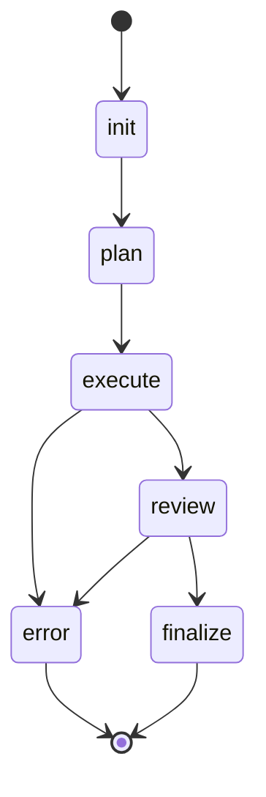
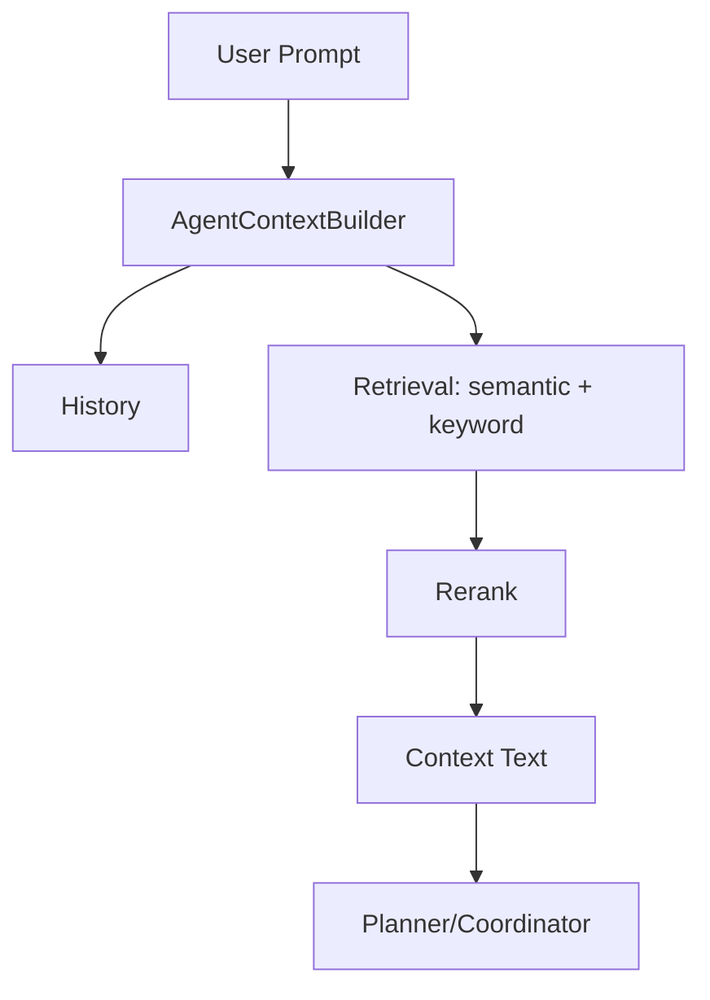
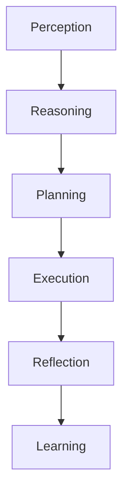

# Arquitetura (IA Assistant)

## Visão Geral

```mermaid
flowchart LR
  UI[UI (Next.js)] -->|/api/chat| GW[CoreGateway (HTTP/WS)]
  GW --> ORCH[AgentOrchestrator]
  ORCH --> COORD[CoordinatorAgent]
  COORD --> PLANNER[PlannerAgent]
  COORD --> RESEARCH[ResearchAgent]
  COORD --> EXEC[ExecutorAgent]
  COORD --> REVIEW[ReviewerAgent]
  COORD --> Q[TaskQueue]
  Q --> W[Workers]
  W --> TOOLS[ToolExecutionEngine]
  W --> MEM[MemorySystem]
  COORD --> GOV[Policy/Governance]
```

## Lifecycle do Agente



## Fluxo de Memória (RAG)



## Reasoning Flow



